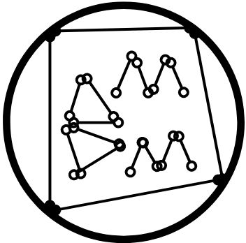

Hello reader!

For the past ten years of my life as a student, I've dedicated myself to the field of competition math. Of all the stuff I could possibly do, numbers have always been by my side throughout my highs and lows as a student. As a way to give back to the mathematics community in the City of Bogo, and with the skills I learned as a problem setter and competitor, I decided to host a friendly online mathematics competition open to the general public!

Introducing, the **Bogohanon Master in Mathematics**!

The **BMM** is a mathematics competition, for elementary and high school math enthusiasts. Although only students studying in the City of Bogo are eligible for prizes, the competition is open to the general public! The aim of the BMM is to

1. Organize a fun and accessible mathematics competition for elementary and high school students in the City of Bogo.
2. Enhance mathematics education through creative problem solving.
3. Expose talented math enthusiasts in the City of Bogo to mathematics being taught outside the classroom.
4. Cater various social interactions through problem solving discussions and reflections.
5. Provide resources for math enthusiasts for various local and international competitions.

# Important Notes

## Schedule

**February 1, 2024** - Registration opens!

**February 14, 2024** - Registration ends.

**February 16-18, 2024** - 2024 BMM!

## Registration

**Link** - link available soon

## Mechanics

**Link** - [https://drive.google.com/file/d/1-qOZaL3t6OV0WnY1b73E3vgFsdJI-OGF/view?usp=drive_link](https://drive.google.com/file/d/1-qOZaL3t6OV0WnY1b73E3vgFsdJI-OGF/view?usp=drive_link)

## Contact
**Email** - [joserollan4@gmail.com](mailto:[joserollan4@gmail.com])

**Messenger Group Chat** - link available soon

## Prizes (for Bogohanon students only)
**Elementary**

1st - 3rd place: 100 pesos + medal

4th - 6th place: medal

Top Female Participant: medal

**High School (Grades 7-9)**

1st - 3rd place: 100 pesos + medal

4th - 6th place: medal

Top Female Participant: medal

**High School (Grades 10-12)**

1st - 3rd place: 100 pesos + medal

4th - 6th place: medal

Top Female Participant: medal
